# Youtube Clone

Cloning youtube with VanillaJS, NodeJS, Pug, MongoDB

Built with:

* Node.js v11.11.0
* Express
* Babel
* WebPack 4
* MongoDB (Atlas)
* Heroku

## Getting Started

### Install
```shell
yarn install
```

### Build
```shell
yarn run build
```

### Start
```shell
yarn start
```

## Deploy

Login heroku

```shell
heroku login
```

Deploy

```shell
git push heroku master
```

## Preview

### Lobby
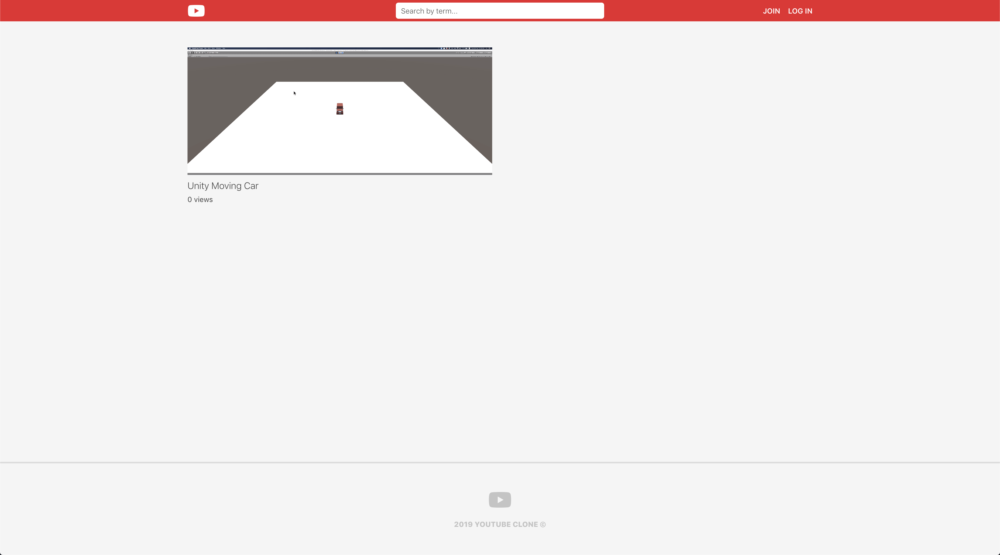

### Lobby (Login)
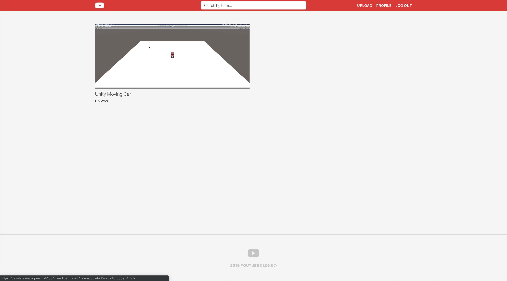

### Join
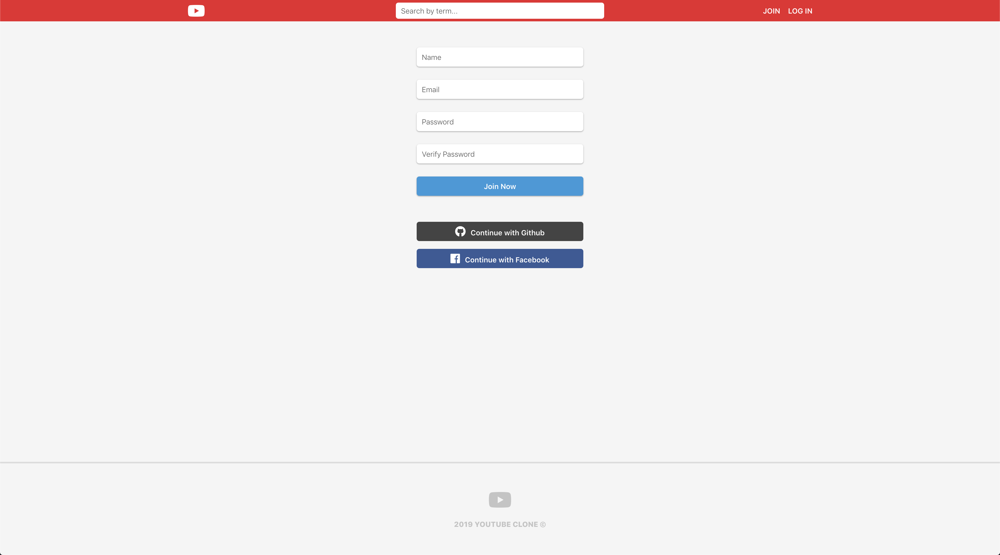

### Login
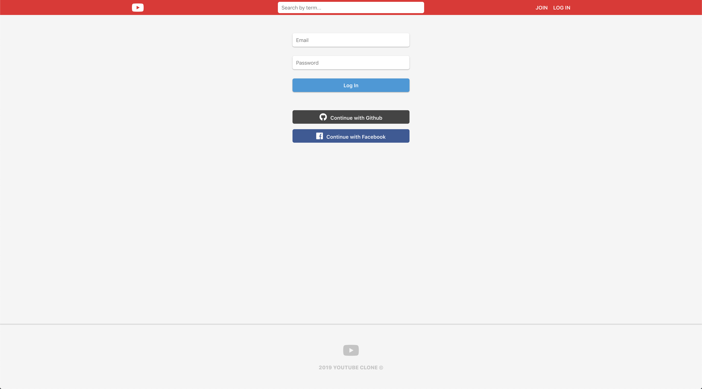

### User Profile
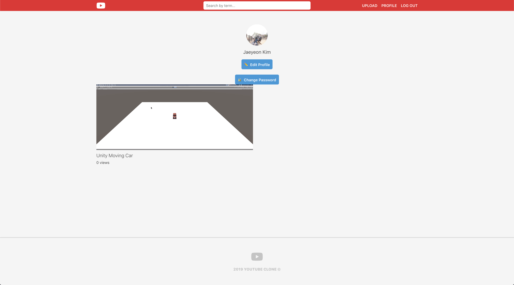

### Edit Profile
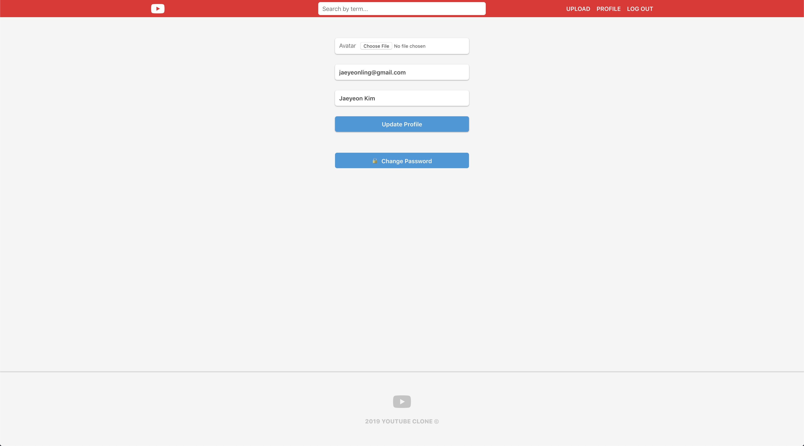

### Change Password
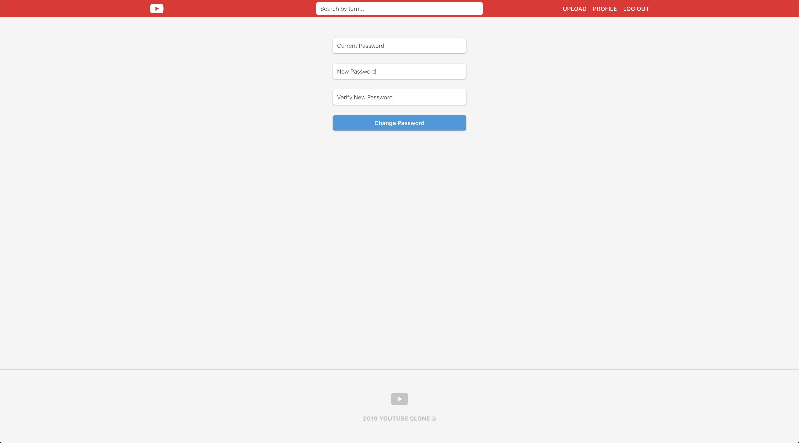

### Upload Video
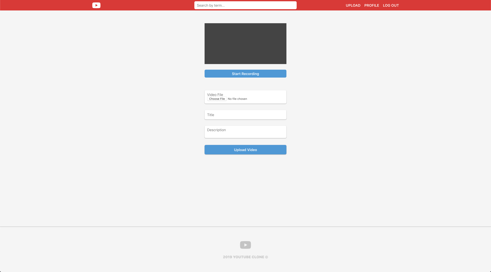

### Search
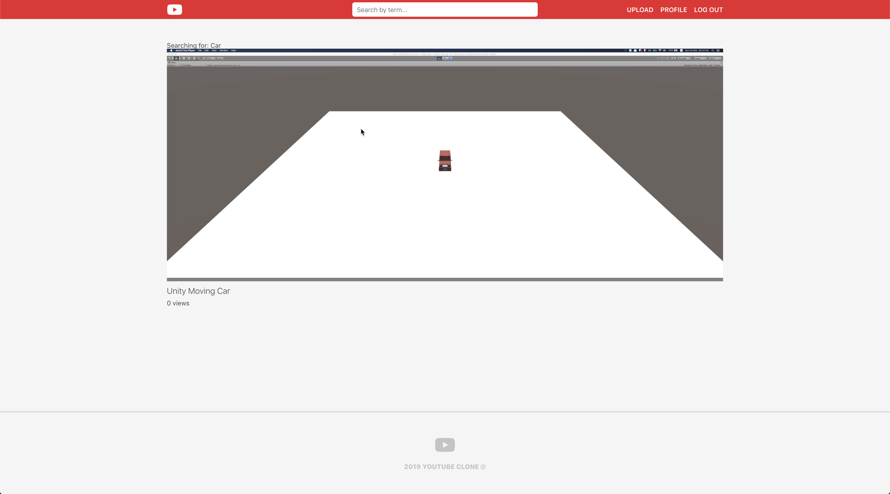

### Video Detail
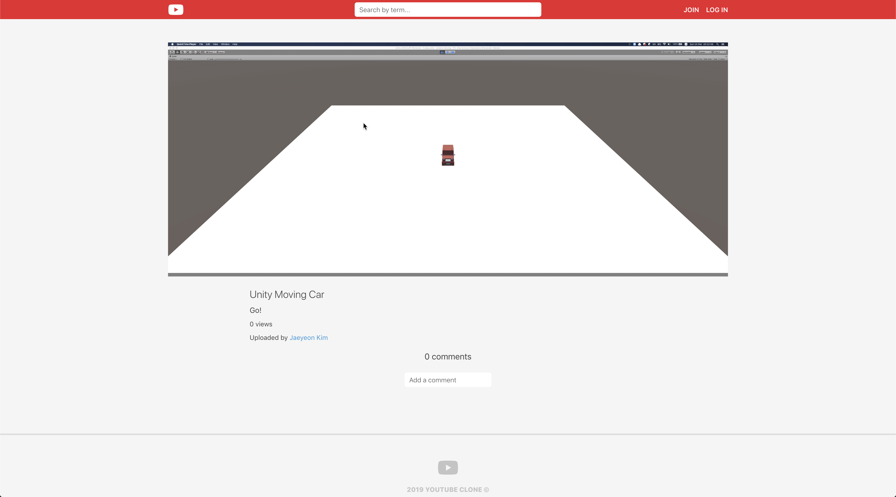

### Video Detail (Login)
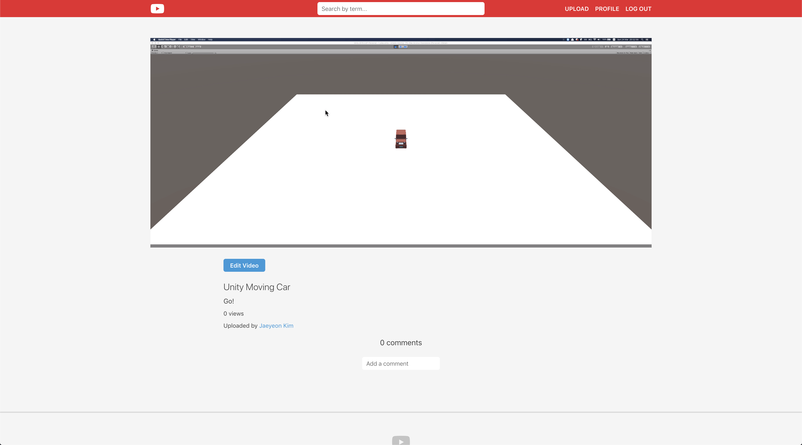

### Edit Video
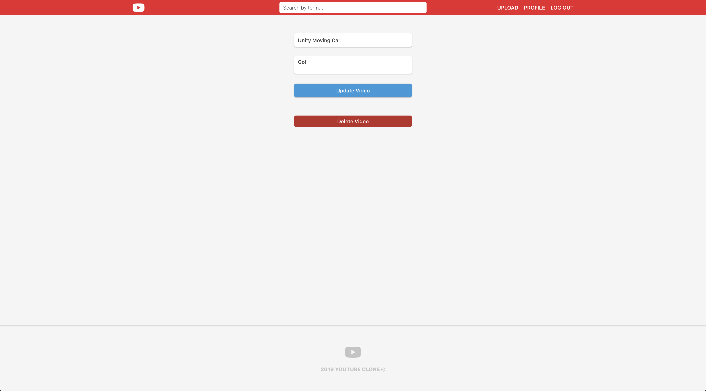